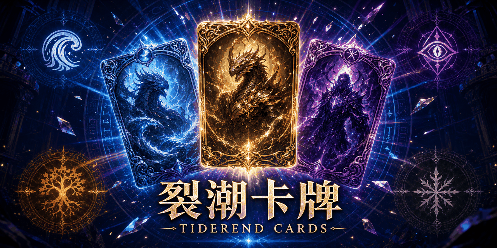
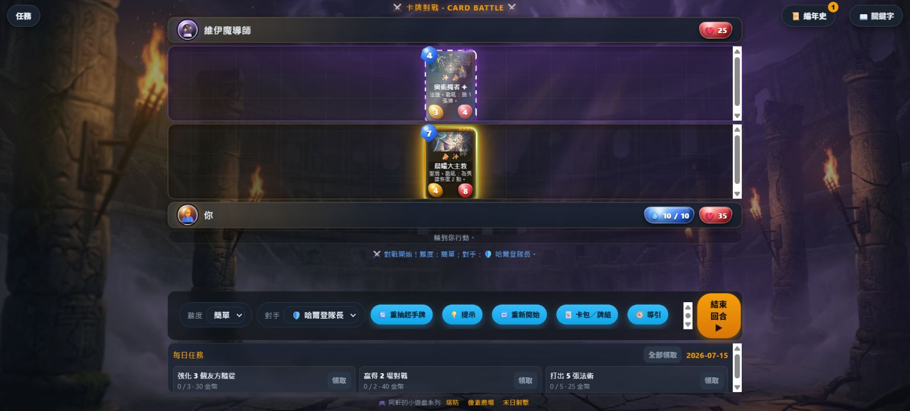
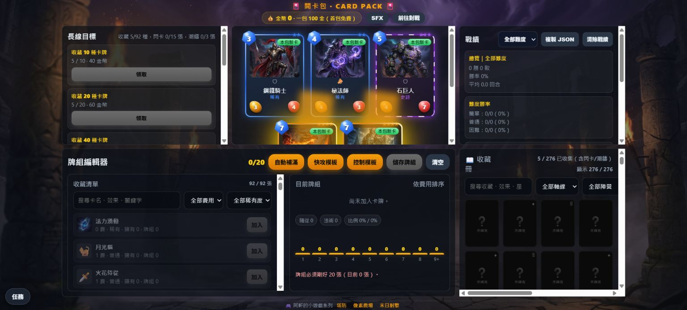
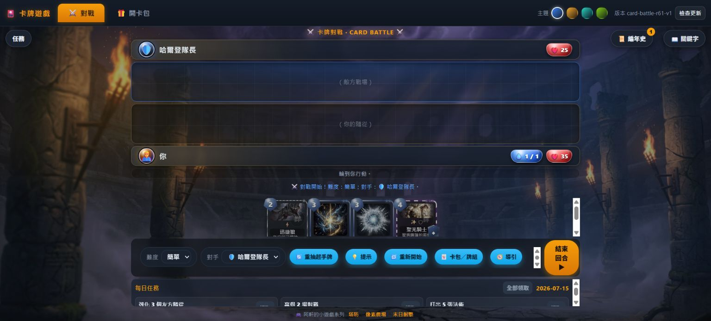

# 裂潮卡牌｜TIDEREND CARDS

[](https://github.com/mars-tw/web-card-game-skill/actions/workflows/ci.yml)
[](LICENSE)
[](https://mars-tw.github.io/web-card-game-skill/)



《裂潮卡牌》是一款以原生 HTML、CSS 與 JavaScript 製作的單人網頁卡牌對戰遊戲。玩家可以開卡包、收集卡牌、組成 20 張牌組，挑戰三位具名 AI 對手；任務、收藏、牌組與戰績皆保存在瀏覽器 `localStorage`，遊戲執行時不需要後端服務。

**[立即線上遊玩](https://mars-tw.github.io/web-card-game-skill/)**

目前版本：`0.4.8`／PWA revision `card-battle-r63-v1`。

## 最新特色（R60–R61）

- **「對座六影」具名傳說角色卡**：哈爾登隊長、維伊魔導師、斯卡拉狼首、伊索德·長暮、霜牙百夫長·魯恩、潮間仲裁者·茉恩；六張卡各有專屬機制與唯一構築限制。
- **角色專屬立繪**：R61 為六位角色補齊統一風格立繪，並接入戰場、開包揭示與收藏冊；卡面美術為 AI 產出，詳見 [CREDITS.md](CREDITS.md)。
- **角色抽取保護**：抽到傳說時有 28% 機率偏向角色子池；連續 35 包未取得角色傳說時觸發保底，並優先補未擁有角色。
- **具名 AI 對手**：哈爾登偏控制、維伊偏法術、斯卡拉偏快攻；可切換簡單、普通、困難與動態難度調節。
- **完整對戰表現**：傳說框掃光、閃卡虹彩、潮印收藏變體、英雄資源寶石、低血量警示，以及可停用的高動態效果。

## 遊戲內容

- **回合制對戰**：法力上限 10、場面上限 7、手牌上限 8，包含疲勞、目標選擇、AI 提示與戰鬥紀錄。
- **92 張卡牌**：25 普通、24 稀有、23 史詩、20 傳說；涵蓋白潮守軍、奧術結社、荒野獸群、凜冬暗影與潮間中立五個陣營。
- **多種規則能力**：嘲諷、衝鋒、戰吼、亡語、聖盾、連擊、劇毒、回復、吸血、突襲、靜默、法強及角色專屬機制。
- **卡包與收藏**：每包 5 張，首包免費、其後每包 100 金幣；稀有以上 20 包保底，另有 8% 閃卡與 3% 潮印變體。
- **牌組工作台**：20 張牌組、同名卡最多 2 張、傳說卡最多 1 張；提供搜尋、費用／稀有度／陣營／關鍵字篩選、曲線圖與快攻／控制模板。
- **長期進度**：每日任務、每週任務、收藏里程碑、白潮編年史、戰績統計與存檔匯出／匯入。
- **PWA 與響應式介面**：支援安裝、離線 fallback、桌機與手機版面、文字大小、音效開關、效能模式與 `prefers-reduced-motion`。

## 操作說明

### 對戰

1. 點選手牌打出隨從或法術；需要指定目標的效果會再提示可選對象。
2. 點選己方可攻擊的隨從，再點敵方隨從或英雄完成攻擊；場上有嘲諷時必須先處理嘲諷目標。
3. 使用「提示」查看本回合建議，操作完成後按「結束回合」。
4. 可隨時切換難度與對手；「重新開始」會依目前設定開新局。

### 開包、收藏與組牌

1. 進入「開卡包」，點卡包後逐張翻牌，或使用略過按鈕一次揭示。
2. 在收藏區搜尋及篩選卡牌；點卡牌可看詳情，分解操作需二次確認。
3. 在牌組編輯器加入或移除卡牌，也可套用快攻／控制模板；合法牌組必須正好 20 張。

介面支援滑鼠、觸控與鍵盤焦點操作；翻牌可用 `Enter`／`Space`，`Esc` 可關閉已開啟的詳情、編年史或任務面板。

## 遊戲畫面

### 具名 AI 對戰



### 開包與牌組工作台



### 桌機遊戲 Shell



## 技術棧

| 類別 | 使用技術 |
|---|---|
| 前端 | HTML5、CSS3、原生 JavaScript（CommonJS 測試相容） |
| 資料與離線 | `localStorage`、Web App Manifest、Service Worker |
| 測試 | Node.js 規則測試、品質守門、平衡模擬、Playwright E2E／RWD |
| CI/CD | GitHub Actions、GitHub Pages |
| 執行期依賴 | 無；瀏覽器直接載入靜態檔案 |

## 本地開發

需求：Node.js 20+、npm、Python 3（只用來啟動靜態伺服器）。

```bash
git clone https://github.com/mars-tw/web-card-game-skill.git
cd web-card-game-skill
npm install
npm start
```

開啟 <http://localhost:8000/templates/index.html>。伺服器必須從 repo 根目錄啟動，否則卡面圖片的相對路徑會失效。

### 測試

```bash
npm test
npx playwright install chromium   # 首次執行瀏覽器測試前
npm run test:e2e
npm run test:rwd
```

- `npm test`：卡牌資料、核心規則、品質守門與平衡模擬。
- `npm run test:e2e`：實際瀏覽器中的對戰、開包、牌組、存檔與 PWA 流程。
- `npm run test:rwd`：Shell、對戰與卡包頁面的多視口矩陣。

進一步的資料格式與美術流程請參考 [references/data-model.md](references/data-model.md) 與 [references/art-generation.md](references/art-generation.md)。貢獻方式見 [CONTRIBUTING.md](CONTRIBUTING.md)。

## 素材、授權與致謝

- 原始碼採 [MIT License](LICENSE)，© 2026 mars-tw。
- AI 卡面、背景、專案圖像、系統字型與第三方開發工具的盤點見 [CREDITS.md](CREDITS.md)。
